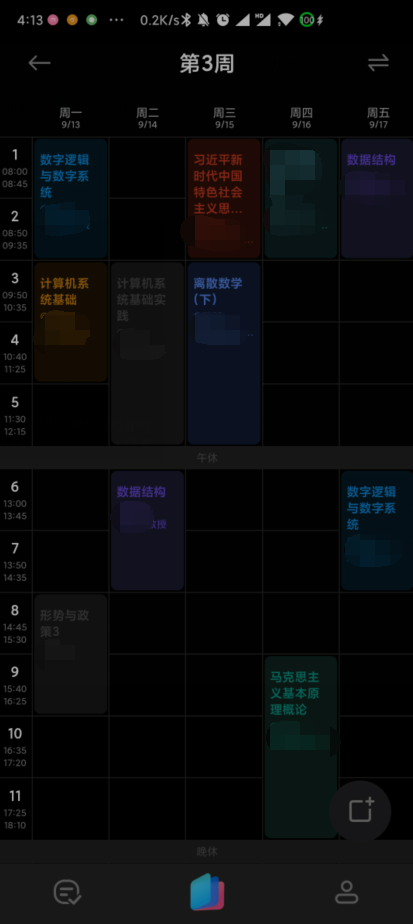

# AIschedu-BUPT
小爱同学/小爱课程表 北京邮电大学本科教务系统解析

## How to use

1. 登录北邮的校园VPN **(使用校园网账号密码)**
2. 选择进入教务管理系统并登录
3. 进入 **学期理论课表**, 加载完成后, 点击导入
4. 完成! 

## Update

- **2021/09/04** 代码完全重构, 改用正则匹配并适配新的小爱同学, 采用MIT开源
  - **2020/09/04 04:23 已提交**

## Preview

